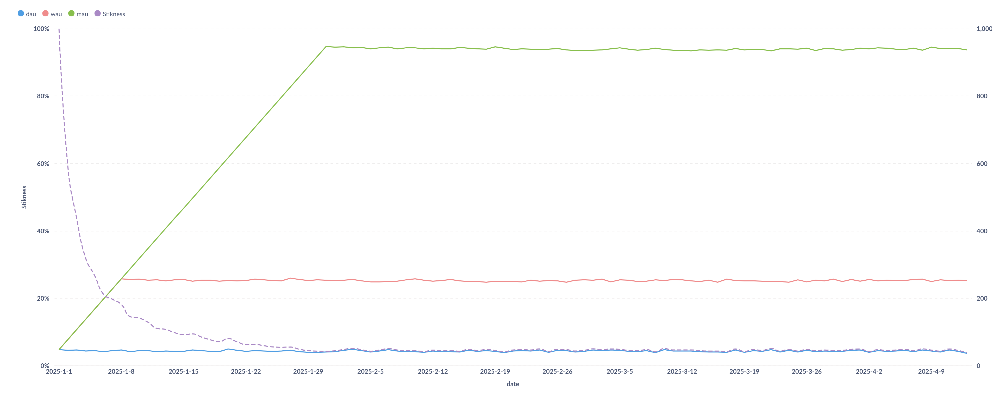
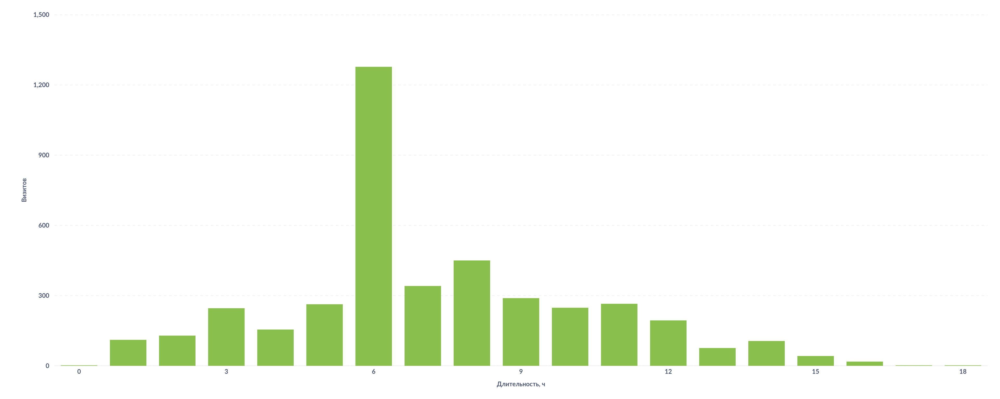
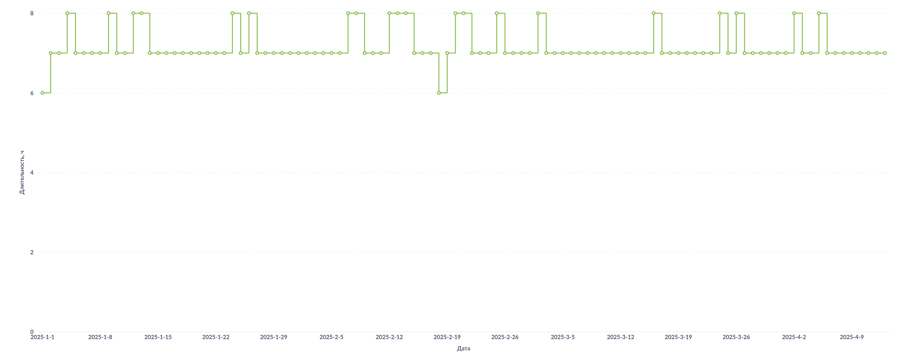
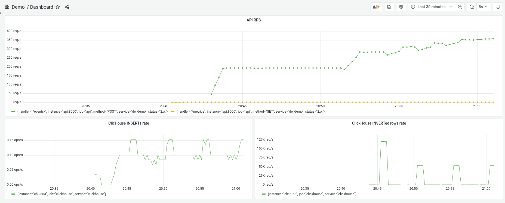

# Демо сервиса сбора и обработки событий
**Пример** сервиса аналитики, отвечающего за приём и обработку событий.
Демо не претендует на полноту ввиду больших трудозатрат на досканальное воспроизведение 
инфраструктуры и задач реальной компании, а в меру сил демонстрирует использование различных технологий.
____
## Описание
- [Демонстрационные данные](#демонстрационные-данные)
- [Архитектура решения](#архитектура-решения)
- [Схема данных](#схема-данных)
  - [События сайта](#cобытия-сайта)
  - [Пользовательская активность](#пользовательская-активность)
- [Структура проекта](#структура-проекта)
- [Инициализация проекта](#инициализация-проекта)
- [BI](#bi)
- [dbt](#dbt)
- [dagster](#dagster)
- [API](#api)
- [Мониторинг](#мониторинг)

## Демонстрационные данные
Исторником данных является воображаемый интернет-магазин с 4мя товарами по которому перемещаются 
пользователи:

## Архитектура решения
Действия пользователей принимаются в [api](#api), и батчами пишутся в [clickhouse](#cобытия-сайта).
Дальнейшая обработка данных происходит при помощи [dbt](#dbt), результаты отображаются в [BI](#bi).

## Схема данных
Для работы с хранилищем используется библиотека [infi-clickhouse-orm](https://github.com/Infinidat/infi.clickhouse_orm).

Схема staging слоя определяется [миграциями](de_demo/migrations/clickhouse).

### События сайта
Представлены двумя [таблицами](de_demo/apps/events/warehouse), которые развертываются 
миграцией [0001_create_events.py](de_demo/migrations/clickhouse/0001_create_events.py).
Демонстрационные данные сгенерированы предварительно и выгружаются из файла [events.xz](data/events.xz).

### Пользовательская активность
Расчёт метрик пользовательской активности производится при помощи [dbt](#dbt).
В [intermediate слой](dbt/models/intermediate/int_site_events_to_users_count_by_day.sql) 
инкрементально пишутся агрегаты по дням, 
витрина представлена [вьюхой](dbt/models/marts/users_activity.sql) 
агрегирующей промежуточные данные за требуемое кол-во дней оконными функциями.

### Сессии
Кликстрим нарезается на сессии при помощи [dbt](#dbt). Сессия завершается по таймауту. 
В [intermediate слой](dbt/models/intermediate/int_site_events_to_user_sessions.sql) инкрементально 
пишется часть таблицы событий с временем предыдущего события и идентификатором сессии.

## Структура проекта
* Код в [de_demo](de_demo) 
* Контейнеризация в [docker](docker)
* Тесты в [tests](tests)

## Инициализация проекта
Можно стартануть в [docker](docker) или локально.

Для запуска проекта локально, необходимо:
- Установить python 3.12([загрузки](https://www.python.org/downloads/)) 
- Установить poetry([инструкция](https://python-poetry.org/docs/#installing-with-the-official-installer))
  - TLDR: `curl -sSL https://install.python-poetry.org | python3 -`
- В корне проекта `poetry env use python3.12` и `poetry install --no-root --all-extras`
- Далее см. [утилиту командной строки](de_demo/cli), [тесты](tests)

## BI
В рамках проекта развёрнут BI на базе [metabase](https://www.metabase.com/).
> Логин `test@test.test`, пароль `1!!test!!1`.
>
> Адрес http://127.0.0.1:13001/collection/root

### Карточки
> Карточки заработают после первого запуска dbt dagster'ом, job запускается в момент старта демона.

#### Пользовательская активность
http://127.0.0.1:13001/question/38-users-activity

#### Распредение длительности визитов
http://127.0.0.1:13001/question/39-dlitel-nost-vizitov

#### Динамика изменения длительности визитов
http://127.0.0.1:13001/question/40-dlitel-nost-vizitov-dinamika

## dbt
Запуск dbt `de-demo run dbt`.  Файл настроек проекта [dbt_project.yml](dbt/dbt_project.yml).

## dagster
> Адрес http://127.0.0.1:13000

Отвечает за обновление dbt моделей:

Файл настроек [dagster.yaml](dagster.yaml). 
Регистрация компонентов в [de_demo/dagster](de_demo/dagster).

## API
При запуске в docker, стартует автоматом. 

Запуск API руками `de-demo run api`.
> ! Для запуска api нужен запущенный clickhouse: 
> 
> `docker compose -f ./docker/docker-compose.warehouse.yml -p de_demo up --build -d`

Сервис приёма событий написан на python с использованием фреймворка FastAPI.

Документация API:
 - Swagger: http://127.0.0.1:18000/docs
 - Redoc: http://127.0.0.1:18000/redoc

Код endpoint'а событий сайта находится [тут](de_demo/apps/events/api).

## Мониторинг
> Логин `admin`, пароль `admin`.
> 
> Адрес http://127.0.0.1:13000/d/q9Or1W0Nz/dashboard?orgId=1&refresh=5s

Видно как под нагрузкой отрабатывает буферизация вставки в ClickHouse:
- на стороне API - `INSERTs rate` ~0.1 или 1 инсерт в 10 сек
- на стороне буферной таблицы ClickHouse - `INSERTed rows rate` скачет периодически при сбросе данных в основную таблицу

